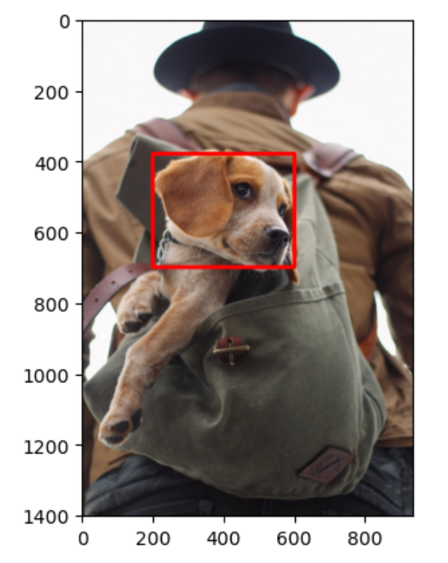
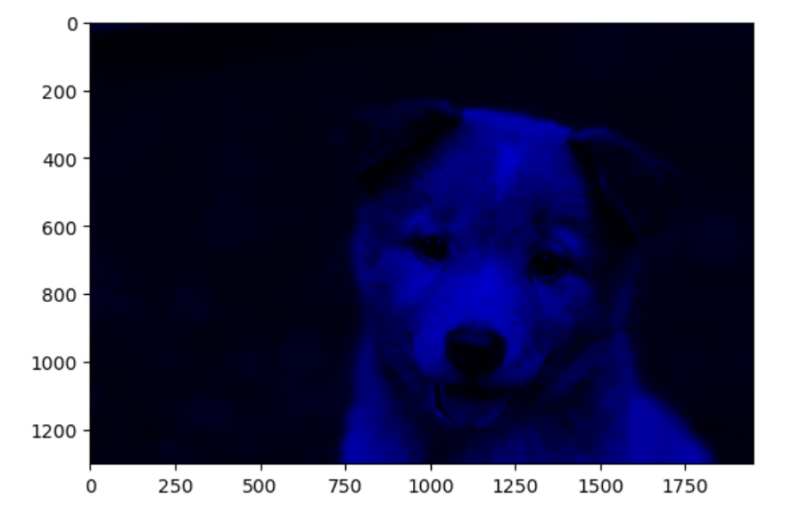

# 🧠 Artificial Intelligence and Computer Vision Courses and Projects

Welcome to my repository showcasing a collection of projects, exercises, and experiments developed through comprehensive training in **Artificial Intelligence (AI)** and **Computer Vision (CV)**. These projects span reinforcement learning, object detection, generative models, and deep learning, using tools like PyTorch, TensorFlow, Keras, OpenCV, and more.

---

## 📚 Courses & Projects

### 1. **Artificial Intelligence A-Z**

#### 🚀 Lunar Lander (DQN)
- Implements **Deep Q-Learning (DQN)** in the `LunarLander-v3` environment from Gymnasium.
- Uses a neural network to estimate Q-values for state-action pairs and learn an optimal landing strategy.
- 🎥 Demo:  
  

#### 👾 Ms. Pac-Man (DCQN)
- Trains a **Deep Convolutional Q-Network (DCQN)** agent to play Ms. Pac-Man using visual input.
- Applies convolutional layers to process game frames and reinforcement learning for action selection.
- 🎥 Demo:  
  

#### 🥋 Kung-Fu Master (A3C)
- Implements **Asynchronous Advantage Actor-Critic (A3C)** to train an agent in the Kung-Fu Master environment.
- Utilizes multiple parallel environments and CNNs for efficient learning.
- 🎥 Demo:  
  

---

### 2. **Deep Learning and Computer Vision A-Z**

#### 📹 Real-Time Object Detection with SSD (PyTorch + OpenCV)
- Uses a pre-trained **SSD (Single Shot Multibox Detector)** model for real-time object detection on video.
- Annotates frames with bounding boxes and class labels using **OpenCV** and **imageio**.
- 🎥 Demo (Horses video object detection):  
  

---

### 3. **Python for Computer Vision with OpenCV and Deep Learning**

A practical course designed to master the foundations of image processing and computer vision using Python and OpenCV.

#### ✅ What I Learned:
- Understand basics of **NumPy**.
- Manipulate and open images with **NumPy**.
- Use **OpenCV** to work with image files.
- Draw shapes and text on images and videos using **OpenCV**.
- Perform image manipulation: **smoothing**, **blurring**, **thresholding**, and **morphological operations**.
- Create and analyze **color histograms**.
- Open and stream video with **Python** and **OpenCV**.
- Detect objects using **corner**, **edge**, and **grid detection**.
- Create **face detection** software.
- Segment images using the **Watershed Algorithm**.
- Track objects in video.
- Build image classifiers using **Python** and **Deep Learning**.
- Work with **TensorFlow**, **Keras**, and train models on custom images.
- 📷 Output Demo:

  
  

---

### 4. **Deep Learning: Advanced Computer Vision (GANs, SSD, LLM)**

This course dives deep into cutting-edge CV topics and architectures used in modern AI applications.

#### ✅ What I Learned:
- Understand and apply **transfer learning**.
- Use advanced CNNs such as **VGG**, **ResNet**, and **Inception**.
- Implement **object detection** with **SSD**.
- Apply **neural style transfer** techniques.
- Explore advanced CV topics including **Class Activation Maps**.
- Learn and build **GANs (Generative Adversarial Networks)**.
- Complete an **Object Localization Implementation Project**.
- Understand key concepts behind **ChatGPT**, **GPT-4**, **DALL·E**, **Midjourney**, and **Stable Diffusion**.

---

## ⚖️ License

This repository is intended for **educational purposes only**. All code and content are provided for **personal learning** and **non-commercial use**. You are welcome to **view**, **study**, and **experiment** with the material.
